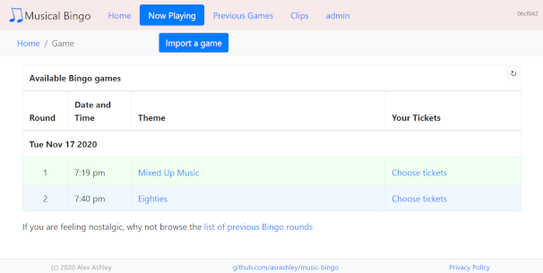

# Bingo Server

This repository contains an HTML application (written in Python and
JavaScript). This application is split into three parts:

* an HTTP server that provides a JSON REST API
* an HTML JavaScript application that can be run from any web browser
* an SMTP server that can send password reset emails

The server provides access to a database that contains information about the
users who are allowed to access the server and to previously generated Bingo games.
To allow multiple people to play bingo on-line, this server needs to be accessible
to all players. Typically, this is achieved by deploying the server to a cloud
service such as Azure or AWS.

The HTML JavaScript application uses the JSON REST API to access bingo games
stored in the database on the server. It allows multiple users to play musical
bingo together, and also provides the ability to administer the database, such as
importing previously created games or modifying the list of authorised users.

To allow users to reset their password if they have forgotten it, an
SMTP server is needed that can send the user an email with a password
reset link.

## Building the HTML JavaScript application

The HTML JavaScript application is a JavaScript application using
[React](https://reactjs.org/) and [Redux](https://redux.js.org/).

[Node.js](https://nodejs.org/en/) is required to compile the JavaScript
application, but is **not** required when running the server.

Once Node.js has been installed, from the client directory, install
the required JavaScript libraries:

    cd client
    npm install -d

Once this has completed, to compile the JavaScript and create a file
_musicbingo-prod.tar.gz_ containing all of this build:

    npm run build

The musicbingo-prod.tar.gz file contains all of the files that need to
be deployed on the server running music bingo.

## Running locally
As a one-time step, create a directory that contains the virtual Python
environment (in this example called "virt"):

    python -m venv virt

Before installing any libraries and before each time you want to run the app,
active the virtual environment.

    . ./virt/bin/activate

Note that this only activates in the current Unix shell / Windows command
prompt. You need to run the activate script every time you start a new
shell / command prompt.

Install the required Python libraries:

    pip3 install -r requirements.txt

To run the server locally:

    python -m musicbingo.server

The server can be accessed on port 5000
[http://localhost:5000/](http://localhost:5000/)

You can now log into the admin account with the credentials:

Username | Password
---------|---------
admin | changeme

If there any bingo games in the database, they will show up in either
the "Now Playing" page or the "Previous Games" page.

## "Bare metal" installation

One deployment option is to run the music bingo service directly on a
Unix server. The HTTP port of this server will need to be accessible
to everyone who will be playing music bingo on-line.

See [baremetal.md](baremetal.md) for a walk-through of installing the music
bingo server directly on a server.

## Amazon AWS installation

As the resources used by the music bingo service are relatively low,
it is possible to run the service in a nano AWS EC2 instance. When high
availability is not required, this allows the service to be hosted for
less than £4 (Europe Ireland) / $4 (US East) per month.

This repository contains CloudFormation scripts to deploy a single EC2
instance with code deploy to automatically install the
musicbingo-prod.tar.gz file.

A high availability system can be created using Aurora RDS,
multiple EC2 instances and an elastic load balancer.

See [aws.md](aws.md) for more information on hosting using AWS.

## Microsoft Azure installation

An App Service can be used to host the service, including the free
service plan. A database service will be required. A serverless
SQL database is quite a good option for minimising costs. A serverless
SQL database combined with a free service plan App Service allows the
music bingo service to be hosted for about £5 per month.

See [azure.md](azure.md) for more information on hosting using Azure.

# Using the HTML JavaScript application
Before following this walk-through of using the HTML application, it
is recommended to create some bingo games using the GUI, so that there
are some clips and some games to import via the HTML application. See
[app.md](app.md) for details of how to use the GUI.

To export the database that the GUI has created:

    python -m musicbingo.models export gui-export.json

Now we can get back to using the HTML application.

First step is to log in to an admin account. The default username and
password is:

Username | Password
---------|---------
admin | changeme

After successfully logging in, you should see the homepage screen.

If you are running the server locally, skip the database import step,
as the server will be using the same database as the GUI.

Click the "admin" button from the top level menu to switch to the
Admin page.

From this page you can import the "gui-export.json" file by clicking
the "Import Database" button.

After importing the database, the "Previous Games" page will show all
of the games with a start date less than today's date. The "Now
Playing" page will show all of the games where the start date equals
today's date.

## Users and Groups

Normally users register themselves into the app, however anyone with an
admin account can manually register users.

Each user is a member of one or more groups. Being the member of
a group provides that user with various privileges.

 group  | privileges
--------|-----------
guests  | A temporary user account which will be removed after 24 hours
users   | Normal group for a registered user.
creator | A user who is able to generate games
host    | A user who is able to claim and release bingo tickets from any user
admin   | A "super user" who has access to all features

Anyone with an admin account can modify the groups that each member
belongs to.

## Now Playing

The Now Playing page shows the list of games that are currently
available to play. By clicking on the name of one of the available
games, you can choose Bingo tickets for that game and view your
tickets.

A user who is a member of the admin or host group is able to claim any
tickets and can release a ticket that someone else has claimed.

By default a user is only allowed to select at most two tickets in a
game. This can be changed by editing the max_tickets_per_user setting
in bingo.ini

The available tickets page will automatically update as other users
select their tickets, showing you which tickets are currently
unclaimed.

Once one or more tickets have been selected, a "Let's Play" button
will appear, which allows you to see your tickets.

Clicking on a cell in Bingo ticket will toggle a tick mark on that
cell. This allows you to play Music Bingo using your web browser.

An alternative is to click the "Download ticket" button, which will
download a PDF file containing the Bingo ticket. This PDF file will
have a check box in each cell.

## Previous Games

The "Previous Games" page will show all of the games with a start date
less than today's date. By clicking on a past game, it will show the
track listing of that game.
